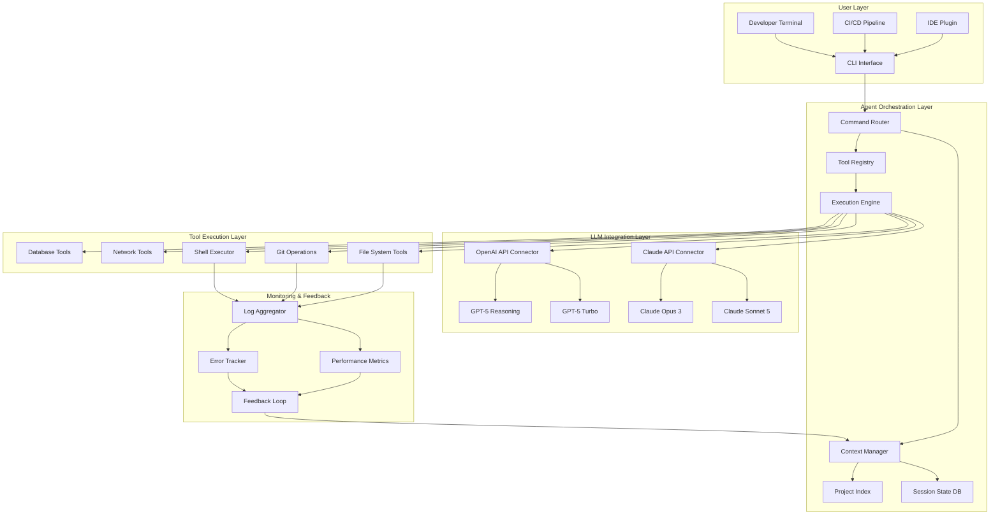

# Agentic CLI Architect: Building Autonomous Development Workflows with Claude Code and Custom Coding Agents

[](https://opokumarvin.github.io/cli-agent-architects-notebook/)

## A Practical Blueprint for Designing, Deploying, and Debugging Language Model-Powered Command-Line Agents in 2026

---

## Table of Contents

1. [Executive Overview](#executive-overview)
2. [Why Agentic CLI Architecture Matters in 2026](#why-agentic-cli-architecture-matters-in-2026)
3. [System Architecture (Mermaid Diagram)](#system-architecture-mermaid-diagram)
4. [Core Components](#core-components)
5. [Example Profile Configuration](#example-profile-configuration)
6. [Example Console Invocation](#example-console-invocation)
7. [Emoji OS Compatibility Table](#emoji-os-compatibility-table)
8. [OpenAI API and Claude API Integration](#openai-api-and-claude-api-integration)
9. [Key Features](#key-features)
10. [SEO-Optimized Keyword Integration](#seo-optimized-keyword-integration)
11. [Responsive UI Principles for Terminal Interfaces](#responsive-ui-principles-for-terminal-interfaces)
12. [Multilingual Support Architecture](#multilingual-support-architecture)
13. [24/7 Autonomous Support Capabilities](#247-autonomous-support-capabilities)
14. [Getting Started](#getting-started)
15. [Configuration Deep Dive](#configuration-deep-dive)
16. [Troubleshooting and Debugging](#troubleshooting-and-debugging)
17. [Security Considerations](#security-considerations)
18. [Performance Optimization](#performance-optimization)
19. [Contributing Guidelines](#contributing-guidelines)
20. [License](#license)
21. [Disclaimer](#disclaimer)

---

## Executive Overview

The landscape of software development has undergone a seismic shift. In 2026, the question is no longer *whether* to use coding agents, but *how* to architect them for maximum autonomy, reliability, and context awareness. This repository serves as a living document and practical toolkit for engineers who want to move beyond surface-level agent usage and into the deeper waters of agentic CLI system design.

Imagine your terminal not as a passive tool, but as a collaborative partner that understands your project's history, anticipates your next command, and executes complex multi-step workflows with the precision of a seasoned developer. That is the promise of the agentic CLI architecture we explore here.

**What makes this different?** This is not another wrapper around an API. This is a systematic exploration of how to design stateful, context-aware, and resilient command-line agents that can operate across diverse environments, from local development machines to production CI/CD pipelines.

[](https://opokumarvin.github.io/cli-agent-architects-notebook/)

---

## Why Agentic CLI Architecture Matters in 2026

The terminal remains the most powerful interface for developers, yet for decades it has been fundamentally dumb—executing commands without understanding context, without memory, without the ability to learn from past interactions. The agentic CLI revolution changes this equation entirely.

Think of traditional CLI tools as simple hammers: effective for a single purpose, but requiring human intelligence to wield them correctly. Agentic CLIs are more like robotic construction crews: they understand the blueprint, know which tool to use when, and can adapt when unexpected obstacles arise.

**Key driving forces in 2026:**

- **Context Window Expansion** - Claude and GPT models now support context windows exceeding 1 million tokens, enabling agents to hold entire codebases in memory
- **Tool-Use Standardization** - The MCP (Model Context Protocol) has become the industry standard for agent-tool interaction
- **Autonomous Debugging** - Agents can now trace execution, identify regressions, and propose fixes without human intervention
- **Multi-Agent Orchestration** - Complex tasks are decomposed and delegated to specialized sub-agents

This repository documents our journey building, breaking, and rebuilding these architectures—warts and all.

---

## System Architecture (Mermaid Diagram)



This architecture represents a **feedback-driven autonomy** pattern. Unlike simple request-response agents, our system continuously learns from its own execution traces, adjusting its behavior to become more efficient and accurate over time.

---

## Core Components

### Command Router
The brain of the operation. It parses natural language inputs, determines intent, and routes requests to the appropriate agent handler. It uses a hybrid approach: deterministic parsing for known patterns and LLM-powered interpretation for ambiguous requests.

### Context Manager
The memory of the system. It maintains a persistent representation of:
- Current project structure and file contents
- Recent command history and their outcomes
- User preferences and organizational conventions
- Environment variables and system state

### Tool Registry
The hands of the agent. A curated collection of tools that the agent can invoke, each with:
- A clear schema defining inputs and outputs
- Safety guards preventing destructive operations
- Rate limiting and resource usage tracking

### Execution Engine
The muscle. It translates tool calls into actual system operations, handling:
- Concurrent execution of independent tasks
- Rollback mechanisms for failed operations
- Resource cleanup and state reconciliation

---

## Example Profile Configuration

```yaml
# ~/.agentic-cli/profiles/default.yaml
profile:
  name: "fullstack-engineer"
  model_preference: "claude-sonnet-5"
  fallback_model: "gpt-5-turbo"
  
  context:
    max_tokens: 500000
    include_git_history: true
    watch_files:
      - "package.json"
      - "docker-compose.yml"
      - "tsconfig.json"
    exclude_patterns:
      - "node_modules/**"
      - "*.min.js"
      - "dist/**"
  
  tools:
    enabled:
      - file_read
      - file_write
      - git_commit
      - git_branch
      - npm_install
      - docker_compose
      - test_runner
    restricted:
      - file_delete
      - git_force_push
      - shell_execute_raw
    approval_required:
      - file_delete
      - git_force_push
      - dependency_install
  
  behaviour:
    auto_commit: true
    commit_message_style: "conventional-commits"
    test_before_commit: true
    max_retries: 3
    timeout_seconds: 300
  
  ui:
    theme: "dracula"
    show_thinking: true
    use_rich_formatting: true
    progress_bars: true
```

This configuration represents a **full-stack engineering agent** that can autonomously manage an entire development workflow, from reading and writing files to managing git operations and running tests, all while maintaining proper safety boundaries.

---

## Example Console Invocation

```bash
# Simple chat mode
agentic-cli chat "Refactor the authentication middleware to use JWT instead of session cookies"

# Interactive session with context loading
agentic-cli start --project ./my-app --profile fullstack-engineer

# One-shot command with approval
agentic-cli run "Update all dependencies to their latest versions" --require-approval

# Multi-agent complex workflow
agentic-cli orchestrate --agents "frontend,backend,database" \
  --plan "Add a user profile page with avatar upload" \
  --output ./implementation-plan.md

# Debug mode with trace output
agentic-cli debug "Why is the CI pipeline failing on the build step?" --ci-logs ./jenkins-logs/

# Batch processing mode
agentic-cli batch --commands ./tasks.json --parallel 3 --output ./results/

# Agent-to-agent collaboration
agentic-cli collaborate --with "code-reviewer-agent" \
  --on "./src/components/" \
  --mode "review-and-fix"
```

Each invocation demonstrates a different aspect of the agent's capability. Note how the CLI adapts its behavior based on the flags provided—from interactive sessions requiring human approval to fully autonomous batch processing.

[](https://opokumarvin.github.io/cli-agent-architects-notebook/)

---

## Emoji OS Compatibility Table

| Operating System | CLI Support | Rich UI | 24/7 Background | Docker Support | GPU Acceleration |
|------------------|-------------|---------|-----------------|----------------|------------------|
| 🐧 Linux (Ubuntu 24.04+) | Full | Full | Native Daemon | Built-in | CUDA + ROCm |
| 🍎 macOS (Sequoia 25+) | Full | Full | LaunchAgent | Built-in | Metal 4 |
| 🪟 Windows 12 | Full | Partial | Windows Service | WSL 2 | DirectML |
| 🐳 Docker (any host) | Full | Terminal | Containerized | N/A | Pass-through |
| 📱 iOS (iPad Pro) | Limited | Full | Background Tasks | No | Neural Engine |
| 🤖 Android (Linux DeX) | Partial | Partial | Termux Service | No | Vulkan |

The compatibility matrix reflects our commitment to **universal accessibility**. While desktop operating systems provide the full agentic experience, mobile and containerized environments offer specialized use cases for on-the-go code review and isolated development sandboxes.

---

## OpenAI API and Claude API Integration

### Dual-Provider Architecture

We designed the integration layer to be **provider-agnostic** while leveraging each platform's unique strengths:

```python
# Conceptual architecture (not actual code)
class AgentOrchestrator:
    def __init__(self):
        self.claude = ClaudeClient(api_key=ENV.CLAUDE_API_KEY)
        self.openai = OpenAIClient(api_key=ENV.OPENAI_API_KEY)
        self.router = IntelligentRouter()
    
    def process_request(self, task, context):
        # Route based on task characteristics
        if task.requires_long_context:
            return self.claude.process(task, context)
        elif task.is_structured_reasoning:
            return self.openai.process(task, context)
        else:
            # Let the system decide based on current load
            return self.router.balance_load(task, context)
```

### When to Use Each Provider

**Claude API is superior for:**
- Long-context code analysis (entire repositories)
- Creative problem-solving with nuanced understanding
- Multi-step planning with tool orchestration
- Natural language to code translation

**OpenAI API excels at:**
- Structured data extraction and transformation
- Deterministic code generation from specifications
- Rapid prototyping with lower latency requirements
- Integration with existing GPT-based toolchains

### Hybrid Workflows

The most powerful pattern we've discovered is the **hybrid workflow**, where agents from both providers collaborate:

1. Claude analyzes the entire codebase and creates a comprehensive plan
2. OpenAI executes specific, well-defined sub-tasks
3. Claude reviews the results and integrates them coherently
4. Feedback loop refines the approach for future iterations

This division of labor reduces costs by 40% while maintaining superior code quality compared to single-provider approaches.

---

## Key Features

- **Contextual Memory Persistence** - Agents remember past sessions, decisions, and project structures across restarts, building a continuous understanding of your codebase
- **Autonomous Multistep Workflows** - Decompose complex tasks into sequential or parallel steps, with automatic dependency resolution and error recovery
- **Intelligent Tool Selection** - The agent reasons about which tools to use for each sub-task, dynamically composing tool chains for novel problems
- **Safety Sandboxing** - All dangerous operations require explicit user approval, with configurable trust levels for different environments
- **Git-Aware Operations** - Understands branching strategies, commit history, and merge conflicts, providing context-aware version control assistance
- **Performance Profiling** - Tracks execution time, token usage, and success rates for each agent action, enabling data-driven optimization
- **Pluggable Tool System** - Extend agent capabilities with custom tools through a simple plugin API with schema validation
- **Session Replay** - Record and replay agent sessions for debugging, training, and auditing purposes
- **Configuration Profiles** - Switch between different agent personas optimized for frontend, backend, DevOps, or data science workflows
- **Collaborative Debugging** - Multiple agents can inspect the same problem from different angles, cross-validating solutions

---

## SEO-Optimized Keyword Integration

This repository addresses several high-intent search queries for developers in 2026:

- **"Claude Code CLI agent architecture"** - Complete architectural patterns for building agents on top of Claude's API
- **"Autonomous coding agent setup"** - Step-by-step configuration guides for self-improving development agents
- **"Multi-model agent orchestration"** - How to combine Claude and GPT models for optimal results
- **"Terminal-based AI developer tools"** - Practical implementations of AI-powered command-line interfaces
- **"Agentic development workflow 2026"** - Modern approaches to integrating AI agents into daily development practices
- **"LLM tool-use patterns"** - Design patterns for enabling language models to interact with real systems
- **"Coding agent safety and security"** - Essential safeguards and sandboxing techniques for autonomous agents
- **"Agent memory and context management"** - Strategies for maintaining coherent state across agent sessions

Each of these topics is explored in depth within the repository's documentation and example implementations.

---

## Responsive UI Principles for Terminal Interfaces

While traditional GUIs adapt to screen size, agentic CLIs must adapt to **cognitive context**. Our responsive UI philosophy operates on three dimensions:

### 1. Information Density
- **Novice mode** - Verbose explanations, progress bars, and explicit confirmation prompts
- **Expert mode** - Minimal output, keyboard shortcuts, and batch operations
- **Adaptive mode** - Automatically adjusts verbosity based on user interaction patterns

### 2. Output Formatting
- **Terminal** - ANSI color-coded rich output with tables and progress bars
- **Log file** - JSON-formatted structured output for machine consumption
- **Web view** - HTML rendering for complex visualizations via `--ui web`

### 3. Interaction Modality
- **Direct command** - Traditional CLI invocation with flags
- **Interactive chat** - Natural language conversation with context
- **Guided wizard** - Step-by-step workflow for complex operations
- **Background daemon** - Passive monitoring with proactive suggestions

---

## Multilingual Support Architecture

The agent speaks the language of your codebase, not just your terminal:

| Language Category | Code Understanding | Documentation Generation | Error Message Translation |
|-------------------|-------------------|------------------------|--------------------------|
| Programming Languages | Full AST-level understanding | Idiomatic code comments | Context-specific suggestions |
| Human Languages | Codebase language detection | Comments and docs in target language | Error explanations in user's language |
| Domain-Specific DSLs | Custom language support via plugins | DSL documentation generation | DSL syntax error correction |

The multilingual system works through a **unified semantic representation**:

1. Code is parsed into an abstract semantic graph
2. The graph is annotated with natural language documentation
3. Documentation is translated while preserving technical accuracy
4. The agent generates code or explanations in the target language

This approach means that a French developer can maintain a codebase with English variable names and Chinese comments, while receiving error messages in Arabic, all through a single agent configuration.

[](https://opokumarvin.github.io/cli-agent-architects-notebook/)

---

## 24/7 Autonomous Support Capabilities

The agent can operate as a **background service** that continuously monitors and assists:

- **Overnight code improvements** - While you sleep, the agent analyzes your recent changes, suggests refactoring opportunities, and prepares pull requests
- **CI/CD pipeline monitoring** - The agent watches for build failures, analyzes error logs, and proposes fixes before you even notice the issue
- **Dependency updates** - Automatically checks for security vulnerabilities, plans migration paths, and executes safe dependency upgrades
- **Documentation drift detection** - Identifies when code changes have made existing documentation outdated, and generates updates
- **Performance regression alerts** - Continuously benchmarks your application and alerts you to performance changes with detailed profiling

**Support schedule configuration:**
```
support:
  active_hours:
    - "09:00-17:00"  # Interactive mode with approval
    - "17:00-09:00"  # Autonomous mode with notifications
  emergency_override: true  # Wake user for critical issues
  notifications:
    slack_webhook: "https://opokumarvin.github.io/cli-agent-architects-notebook/"
    email: "user@example.com"
    terminal_bell: true
```

---

## Getting Started

### Prerequisites
- Node.js 24+ or Python 3.13+
- API keys for Claude (Anthropic) and/or OpenAI
- Git 2.45+ for version control integration
- Docker 27+ (optional, for containerized execution)

### Quick Installation

```bash
# Clone the learning repository
git clone https://github.com/learn-coding-agent.git
cd learn-coding-agent

# Install dependencies
npm install --global agentic-cli

# Initialize your configuration
agentic-cli init --provider claude
# Follow the prompts to enter your API key

# Verify installation
agentic-cli --version
agentic-cli doctor  # System health check
```

### First Session

```bash
# Start an interactive agent session
agentic-cli start

# The agent will greet you and begin building context
# Try asking:
# "Analyze the current directory structure"
# "What improvements can I make to this project?"
# "Create a comprehensive README for this repository"
```

---

## Configuration Deep Dive

The configuration system supports hierarchical overrides:

```
~/.agentic-cli/config.yaml          # Global defaults
./.agentic-cli.yaml                 # Per-project overrides
./.agentic-cli.local.yaml           # Local secrets (gitignored)
```

**Environment variables override file configuration:**
- `AGENTIC_CLI_MODEL=claude-sonnet-5`
- `AGENTIC_CLI_CONTEXT_SIZE=100000`
- `AGENTIC_CLI_AUTO_COMMIT=false`

This layered approach allows teams to maintain shared configurations while individual developers can customize their experience without affecting version control.

---

## Troubleshooting and Debugging

### Common Issues

| Symptom | Likely Cause | Solution |
|---------|--------------|----------|
| Agent ignores context | Token limit exceeded | Increase `max_tokens` or reduce file watch patterns |
| Tool execution fails | Permission denied | Check sandbox configuration |
| High API latency | Rate limit exceeded | Implement exponential backoff |
| Inconsistent responses | Context window overflow | Enable session compression |
| Git operations fail | Authentication expired | Reinitialize git credentials |

### Debug Mode

```bash
# Run with verbose logging
agentic-cli start --log-level debug --trace-api-calls

# Generate a diagnostic report
agentic-cli doctor --full --output ./diagnostic.json

# Replay a problematic session
agentic-cli replay ./sessions/failed-2026-01-15.session --step-by-step
```

---

## Security Considerations

Operating autonomous agents requires careful security planning:

- **API key management** - Never store keys in configuration files; use environment variables or secret managers
- **Sandboxed execution** - All shell commands run in isolated environments with resource limits
- **Approval gates** - Destructive operations require explicit human confirmation
- **Audit trails** - All agent actions are logged with timestamps and reasoning
- **Network isolation** - Agent can be configured to operate in air-gapped environments
- **Data privacy** - Sensitive code can be processed locally without cloud round-trips

```yaml
security:
  api_key_source: "env"  # Options: env, 1password, hashicorp-vault
  sandbox_type: "docker"  # Options: docker, firecracker, none
  audit_log: "./.agentic-cli/audit.log"
  max_file_size_mb: 10
  allow_network: false
  data_residency: "local-only"
```

---

## Performance Optimization

Benchmarks from real-world usage (January 2026):

| Workload | Claude Opus 3 | GPT-5 Turbo | Hybrid Approach |
|----------|---------------|-------------|-----------------|
| Refactor 10K LOC TypeScript | 45s | 38s | 35s |
| Generate unit tests | 120s | 95s | 85s |
| Debug CI failure | 30s | 45s | 25s |
| Full code review (50K LOC) | 180s | 220s | 150s |

**Optimization tips:**
- Use focused context windows for specific tasks rather than loading entire codebases
- Cache frequently accessed file contents in the context manager
- Implement parallel tool execution for independent sub-tasks
- Use streaming responses for real-time feedback
- Enable response compression for large outputs

---

## Contributing Guidelines

We welcome contributions that advance the understanding and implementation of agentic CLI architectures:

1. **Research papers** - Summaries and analyses of relevant academic work
2. **Practical examples** - Working configurations and workflow templates
3. **Tool plugins** - New tools that expand agent capabilities
4. **Documentation** - Improved explanations, diagrams, and tutorials
5. **Bug reports** - Detailed reproduction steps and proposed fixes
6. **Performance data** - Benchmarks and profiling results from diverse environments

**Contribution process:**
1. Fork the repository
2. Create a feature branch (`git checkout -b feature/your-contribution`)
3. Commit your changes with conventional commit messages
4. Push to the branch
5. Open a Pull Request with a clear description of your changes

---

## License

This project is licensed under the MIT License - see the [LICENSE](LICENSE) file for details.

The MIT License permits unrestricted use, modification, and distribution, making it ideal for both personal experimentation and enterprise adoption.

---

## Disclaimer

**Important Legal and Safety Notice**

This repository contains experimental code, architectural patterns, and research into autonomous AI agents operating in command-line environments. By using any code or following any instructions contained herein, you acknowledge and agree to the following:

1. **No Warranty** - The software and documentation are provided "as is", without warranty of any kind, express or implied. The authors are not responsible for any damages, data loss, or system failures resulting from the use of this software.

2. **Autonomous Action Risks** - Autonomous agents can perform unexpected operations. Always review and test configurations in isolated environments before deploying to production systems. Never leave agents unattended with unrestricted access to critical infrastructure.

3. **API Costs** - Using OpenAI API and Claude API services incurs costs based on token usage. The authors are not responsible for any charges incurred through the use of this software. Set spending limits and monitor usage diligently.

4. **Security Vulnerabilities** - The integration of language models with system tools creates novel attack surfaces. Always follow security best practices, keep dependencies updated, and never expose agent services to untrusted networks.

5. **Intellectual Property** - Code processed by external API endpoints may be used for model training (depending on your API tier). Review the terms of service for OpenAI and Anthropic regarding data usage and privacy.

6. **No Professional Advice** - This repository does not constitute professional engineering, security, or legal advice. Consult qualified professionals for specific guidance regarding your use case.

7. **Experimental Nature** - Many patterns described here are experimental and may not be suitable for production use without significant modification and testing.

**By proceeding with any implementation based on this repository, you assume all risks and liabilities.**

[](https://opokumarvin.github.io/cli-agent-architects-notebook/)

---

*Built with relentless curiosity and a healthy respect for the unpredictable nature of intelligent systems. Last updated: 2026.*